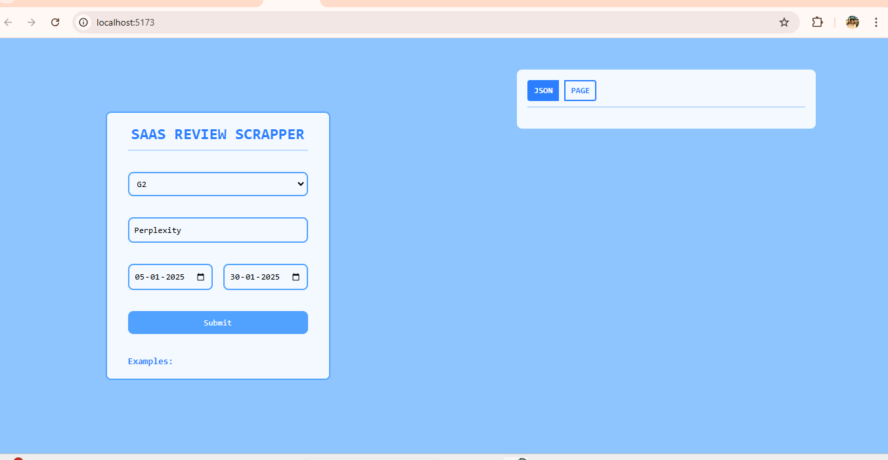
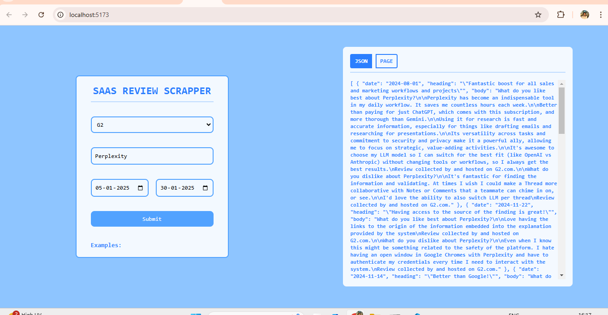

# SAAS Review Scrapper

## Running the Project Locally

### Frontend

1. Navigate to the `frontend` directory:
    ```sh
    cd frontend
    ```
2. Install the dependencies:
    ```sh
    npm install
    ```
3. Start the development server:
    ```sh
    npm run dev
    ```

### Backend

1. Navigate to the `backend` directory:
    ```sh
    cd backend
    ```
2. Install the dependencies:
    ```sh
    npm install
    ```
3. Start the backend server:
    ```sh
    node server.js
    ```

### API Description 

    /**
     * POST /api/reviews
     * 
     * This API endpoint handles the submission of review scraping requests.
     * It accepts a JSON payload with the following properties:
     * 
     * - product_name: The name of the product to scrape reviews for.
     * - start_date: The start date for the review scraping period.
     * - end_date: The end date for the review scraping period.
     * - website: The website to scrape reviews from (currently only supports "g2").
     * 
     * If the website is "g2", it will scrape reviews from G2 for the specified product
     * and date range, and return the reviews as a JSON response.
     * 
     * If the website is not supported, it will return a 400 status code with an error message.
     * 
     * @param {Object} req - The request object.
     * @param {Object} res - The response object.
     * 
     * @returns {JSON} - A JSON object containing the scraped review data or an error message.
     */

JSON for perplexity:
[
  {
    "date": "2024-08-01",
    "heading": "\"Fantastic boost for all sales and marketing workflows and projects\"",
    "body": "What do you like best about Perplexity?\n\nPerplexity has become an indispensable tool in my daily workflow. It saves me countless hours each week.\n\nBetter than paying for just ChatGPT, which comes with this subscription, and more thorough than Gemini.\n\nUsing it for research is fast and accurate information, especially for things like drafting emails and researching for presentations.\n\nIts versatility across tasks and commitment to security and privacy make it a powerful ally, allowing me to focus on strategic, value-adding activities.\n\nIt's awesome to choose my LLM model so I can switch for the best fit (like OpenAI vs Anthropic) without changing tools or workflows, so I always get the best results.\nReview collected by and hosted on G2.com.\n\nWhat do you dislike about Perplexity?\n\nIt's fantastic for finding the information and validating. At times I wish I could make a Thread more collaborative with Notes or Comments that a teammate can chime in on, or see.\n\nI'd love the ability to also switch LLM per thread\nReview collected by and hosted on G2.com."
  },
  {
    "date": "2024-11-22",
    "heading": "\"Having access to the source of the finding is great!\"",
    "body": "What do you like best about Perplexity?\n\nLove having the links to the origin of the information embedded into the explanation provided by the system\nReview collected by and hosted on G2.com.\n\nWhat do you dislike about Perplexity?\n\nEven when I know this might be something related to the safety of the platform. I hate having an open window in Google Chromes with Perplexity and have to authenticate my credentials every time I need to interact with the system.\nReview collected by and hosted on G2.com."
  },
  {
    "date": "2024-11-14",
    "heading": "\"Better than Google!\"",
    "body": "What do you like best about Perplexity?\n\nAs an early user, I find it perfect for research and idea and knowledge generation. I use it contantly for all kinds of information (since late 2022).\nReview collected by and hosted on G2.com.\n\nWhat do you dislike about Perplexity?\n\nThere are not many, follow up questions sometimes are less accurate than needed. But, there are no flaws to content generation.\nReview collected by and hosted on G2.com."
  },
  {
    "date": "2024-12-15",
    "heading": "\"Easy to use and accurate information\"",
    "body": "What do you like best about Perplexity?\n\nIt is very easy to use and navigate. It helps me in finding leads within our industry as well as company details.\nReview collected by and hosted on G2.com.\n\nWhat do you dislike about Perplexity?\n\nDoes not give me the direct contact person so I need to use in conjunction with additional software.\nReview collected by and hosted on G2.com."
  },
  {
    "date": "2024-10-29",
    "heading": "\"Perplexity has become my go to for searching anything\"",
    "body": "What do you like best about Perplexity?\n\nI love that it uses multiple sources and cites them. It provides great results when trying to do research, learning or creating content. Super easy to use.\nReview collected by and hosted on G2.com.\n\nWhat do you dislike about Perplexity?\n\nThe ability to get information out of perplexity and into my own tools\nReview collected by and hosted on G2.com."
  },
  {
    "date": "2025-01-21",
    "heading": "\"Alternate to google\"",
    "body": "What do you like best about Perplexity?\n\nDetaled summarized result with sources URL\nReview collected by and hosted on G2.com.\n\nWhat do you dislike about Perplexity?\n\nBit expensive, should have alternate pricing models.\nReview collected by and hosted on G2.com."
  },
  {
    "date": "2024-03-26",
    "heading": "\"An intuitive and enticing way to use AI to boost knowledge\"",
    "body": "What do you like best about Perplexity?\n\nThe simple question format makes prompt building incredibly simple, but it is the multi-layered responses where the power lies.\n\nA brief question such as \"What makes the best beef pie?\" brings up a selection of highly-rated recipes, cooking tips, and advice on which ingredients are best.\n\nSo, rather than googling each factor, all the information (and some follow-up questions) is presented on one page.\n\nIn addition, the search is saved to your profile, so you can revisit the information at any time.\n\nIt is easy to use and, by far, one of my favourite AI tools.\nReview collected by and hosted on G2.com.\n\nWhat do you dislike about Perplexity?\n\nUnfortunately, much as I love this app, it is easy to forget. I still default to Google or head to other information-gathering tools by default (perhaps that's an age/habit thing).\n\nI have Perplexity on my phone's home screen and still forget about it.\nReview collected by and hosted on G2.com."
  },
  {
    "date": "2024-10-20",
    "heading": "\"Great AI tool to get the information from the source\"",
    "body": "What do you like best about Perplexity?\n\nI was able to search for specific topics with sources. Instead of throwing random information, Perplexity shows where the information is taken, from its source, and I'm able to verify if the source is from a reliable website. While searching for writing content or searching about certain research topics finding sources is almost important and Perplexity does it better. It's easy to use on PC and Mobile and its UI is very user friendly. Perplexity can be used and relied up on everyday for extensive search and writing.\nReview collected by and hosted on G2.com.\n\nWhat do you dislike about Perplexity?\n\nThere is nothing much to dislike, however, I would encourage them to add research papers as sources as well.\nReview collected by and hosted on G2.com."
  },
  {
    "date": "2024-04-16",
    "heading": "\"summary with sources\"",
    "body": "What do you like best about Perplexity?\n\nI was using many generative AI tools , but something special about Perplexity is it will give the response in a summarized way citing the sources which helps me verify inforamtion and extactly where the inforamtion is getting . Another best thing is it will give information in real time\nReview collected by and hosted on G2.com.\n\nWhat do you dislike about Perplexity?\n\nIt is not best fit for local languages like Telugu\nReview collected by and hosted on G2.com."
  },
  {
    "date": "2024-04-02",
    "heading": "\"Awesome experience of using this AI tools\"",
    "body": "What do you like best about Perplexity?\n\nIn this AI Tool i have noticed that this tool gives the urls that will give you the exact summary about the topic that you search for and provide you the source from which you can get more details about it not like the other ai tools which give you only response and not provide the source from where it got the data and summarize it.its solutions can be integrated easily on the platform.It is easy to use you just need to write your query and it will provide you the solution ,you can implement the solutions provided from it .I used this software frequently whenever i need accurate and fast solutions.Till now i have taken the help from their customer support and got the right guidance and support.\nReview collected by and hosted on G2.com.\n\nWhat do you dislike about Perplexity?\n\nIt did not have the ability to access external sources beyond the search results presented by me . Therefore, my responses are limited to the content within those sources .\nReview collected by and hosted on G2.com."
  }
]


Home Page


Result Page
